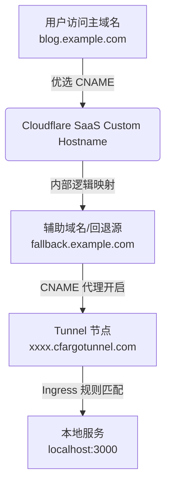

#前言

之前写过一篇《Cloudflare Tunnel 的优选实践》，介绍了如何通过 **Tunnel + SaaS + 优选 CNAME** 的组合方案，改善特定网络环境下的访问体验。这种方案特别适合**手里有低配 VPS、但服务器原生 IP 线路不佳或带宽有限**的个人站长——依托 Cloudflare Tunnel 解决公网穿透与隐藏源站的问题，再结合 SaaS 接入优选 CNAME 降低国内访问延迟。

但在实际长期使用中，这个方案暴露出了一个很明显的痛点：**底层逻辑虽然清晰，但机械重复的手动配置极其折磨人。**

每当我们想给一套服务绑定新的访问域名时，完整的操作流程往往需要经历多步折返跑：

1. 打开 Cloudflare Dashboard，定位到对应 Tunnel，修改 Public Hostname 路由规则；
2. 切换到 DNS 面板，分别给主域名和辅助域名添加 CNAME 记录，还要小心确认“小橙云”代理状态的开关；
3. 再进入 SSL/TLS 的 Custom Hostnames 页面，绑定回退源并申请证书；
4. 只能坐在屏幕前，等待各节点配置下发和 DNS 验证生效。

即便流程再熟练，纯手工配置完一个站点的全套优选链路也需要 **5 到 7 分钟**。一旦管理着多个 Tunnel 或频繁增减项目，长时间在控制台多个页面之间反复跳转，不仅枯燥，而且极易在某个层级漏掉配置，导致出现 522 或 404 错误。

既然所有的步骤都是固定且高度标准化的，为什么不交由程序代劳？于是我动手开发了 **Cloudflare Tunnel Manager**。

现在，绑定一个新的全套优选站点，只需要在控制台填入服务所在端口（例如 http://localhost:3000）、选择主域名与辅助域名，点击提交。人工耗时直接从几分钟缩减为 **3 分钟以内**（其中大部分时间是等待 Cloudflare 后端生效），全程无需再去控制台页面来回切换。

> **📦 Cloudflare Tunnel Manager**
>
> 将 Cloudflare Tunnel 的优选链路配置从手工操作彻底自动化的开源工具。
>

::github{repo="qiuyuxc/tunnel-manager"}

> ⭐ 如果觉得有用，欢迎给它一个 Star！

---

## 真正复杂的不是穿透，而是核心能力的编排

很多人最初接触 Cloudflare Tunnel 时，认识大多停留在简单的单向穿透层面上：


但在引入 SaaS 与优选方案后，为了让流量能够平滑、高速地走到源站，中间涉及的依赖关系演变为一个多层的级联结构。当用户发起一次访问请求时，流量实际通过了完整的五层网关：



如果此时先直接去添加 DNS 解析，外部流量进来了，但 Tunnel 本身根本不认识这个域名，访问就会立即崩溃。

因此，这个管理工具核心解决的并不是“如何创建一个 Tunnel”，而是**理清所有配置的先后依赖顺序，把原本割裂的 Cloudflare API 组合成一套严丝合缝的工作流**。

## 核心解法：自动化绑定工作流的 5 个步骤

在项目后端的 `BindDomain` 核心业务逻辑中，只要接收到用户在 Web 面板发起的绑定请求，程序便会严格按照正确的数据流动顺序，自动执行以下 5 个步骤：

1. **并行查询 Zone ID**：通过 Cloudflare Zone API，自动解析并获取主域名与辅助域名各自所属的 Zone ID，为后续跨域操作准备上下文。
2. **更新 Tunnel Ingress 路由表**：读取指定 Tunnel 当前的路由配置，在本地将主域名和辅助域名与目标服务（如 http://localhost:3000）绑定，再推送更新到云端。
3. **下发辅助域名 DNS 记录**：在辅助域名所在 Zone 中，创建一条指向 `<tunnel-id>.cfargotunnel.com` 的 CNAME 记录，并将代理状态**强制开启**（Orange Cloud 橙色云朵），让其承载回源通道。
4. **下发主域名 DNS 记录**：为主域名创建指向你自定义优选 CNAME 地址的解析记录，同时将代理状态**强制关闭**（Gray Cloud 灰色云朵），确保公网流量走优选网络直连。
5. **构建 SaaS 关联与发证书**：调用 API 将辅助域名设定为当前 Zone 的 Fallback Origin（回退源），并创建 Custom Hostname 将主域名与该回退源关联，触发 Edge 自动为域名签发 SSL 证书。

这一套固化流程彻底终结了手工操作时的顺序错乱问题，只要 API 均返回成功，这条优选访问链路便能做到零失误落地。

## 硬核细节：API 编排中的两处关键实现

在通过代码调用 Cloudflare API 时，单纯的参数拼接没有难度，真正的技术痛点在于**如何安全地修改线上配置而不破坏原有服务**。在此过程中，有两处关键的代码逻辑值得分享。

### 1. Tunnel Ingress 兜底规则的“插队”处理

在编写更新 Tunnel 路由规则的代码时，新手最容易踩的坑就是**直接往数组最尾部追加新规则**。一旦这样做了，新绑定的域名访问时百分之百会返回 404。

原因在于，Cloudflare Tunnel 的 Ingress 路由是**自上而下逐条匹配**的。系统在创建 Tunnel 时，一定会默认在 Ingress 列表的最末尾生成一条强制性的兜底规则（Catch-all Rule）：

```json
{
  "service": "http_status:404"
}
```

如果你无脑追加，新域名规则永远排在 `http_status:404` 后面，请求还未抵达你的服务就被拦截抛弃了。

在处理这个逻辑时，必须通过切片操作，精确把兜底规则剥离出来，将新规则“插队”到它的前面，最后再把兜底规则放回队尾：

```go
// handlers/domain.go (64-77)
newRules := []models.IngressRule{
    {Hostname: req.MainDomain, Service: cfg.ServiceURL},
    {Hostname: req.AuxDomain, Service: cfg.ServiceURL},
}

ingress := tunnelCfg.Result.Config.Ingress
// 1. 提取出当前数组末尾的兜底规则 (http_status:404)
lastRule := ingress[len(ingress)-1]  

// 2. 将新规则追加到除去兜底规则之外的切片后方
ingress = append(ingress[:len(ingress)-1], newRules...) 

// 3. 将兜底规则重新追加回切片的绝对最末尾
ingress = append(ingress, lastRule)
```

这段简单的切片重组，确保了每一次添加新站点，路由表的优先级顺序都是健康正确的，从根本上杜绝了配置污染。

### 2. SaaS Custom Hostname 与回退源的分步注入

SaaS 架构的核心在于**把“门面（主域名）”和“后勤（辅助域名）”完全解耦**。这要求在代码层面对它们做严格的分步操作。

后端在绑定 Custom Hostname 时，并不是将请求一股脑塞进一个接口，而是拆分为明晰的数据映射结构：

```go
// services/cloudflare.go (225-242)
func (c *CloudflareClient) CreateCustomHostname(zoneID, hostname, originServer string) error {
    payload := map[string]interface{}{
        "hostname":             hostname,     // 外部公网访问的主域名
        "custom_origin_server": originServer, // 底层承载回源的辅助域名
        "ssl": map[string]interface{}{
            "method": "http",
            "type":   "dv",
        },
    }
    // 发起 POST /zones/{zoneID}/custom_hostnames
}
```

这段逻辑执行能够成功的**核心前提**，是必须提前让 Cloudflare 确认你的辅助域名的合法身份。因此，在项目代码的 `SetFallbackOrigin` 方法中，会先发起一个 `PUT /zones/{zoneID}/custom_hostnames/fallback_origin` 请求，将辅助域名注册为生效的回退源。只有先在云端确立了后勤底座，后续针对门面主域名的证书申请和路由分配才能顺利执行。

## 极简架构与工程化落地

为了保证项目既轻量又易于在各种闲置 VPS 上分发，整个系统采用了前后端分离但整合构建的极简架构：

```
┌──────────────┐     ┌──────────────┐     ┌──────────────────┐
│  Vue 3 前端   │────▶│  Go 后端 API  │────▶│ Cloudflare API   │
│  Naive UI    │     │  chi router  │     │ Tunnels / DNS    │
└──────────────┘     └──────────────┘     └──────────────────┘
```

- **前端**：采用 **Vue 3 + TypeScript + Naive UI + Pinia** 构建，界面直观，主要提供交互表单与实时状态日志。
- **后端**：使用 **Go 搭配 chi 路由**，采用轻量级 JSON 文件存储（`data/config.json`），完全不依赖外部庞大的数据库引擎，内存占用极低。
- **构建层**：在 Dockerfile 中设计了标准的 **多阶段构建（Multi-stage Build）**。利用 `node:20-alpine` 编译前端产物，`golang:1.22-alpine` 编译后端二进制文件，最终拼接到纯净的 `alpine:3.19` 镜像中。整个最终产物镜像极小，运行资源开销微乎其微。

### 针对国内 VPS 环境的部署优化

考虑到不少开发者使用这套工具的出发点，就是为了优化那些线路不佳的 VPS，我们在自动化部署脚本 `install.sh` 和 Docker 构建层面加入了许多针对性的国内环境适配优化：

- **镜像源智能加速**：在拉取和执行构建时，如果是在国内服务器运行，脚本会通过超时测试自动探测 `ghcr.io` 的连通性。如果响应超过 3 秒，会自动平滑切换为南京大学镜像源 `ghcr.nju.edu.cn`，配置文件也会通过 `ghfast.top` 镜像代理加速拉取。
- **零配置自启动与安全防护**：一键安装脚本通过交互式命令行引导用户填入 Cloudflare 凭据后，直接生成 `.env` 并启动容器。如果用户未手动设定 `ADMIN_PASSWORD`，系统将在初始化运行中**自动随机生成一个高强度的密码**并输出到日志中，防止面板暴露在公网时被人利用。

部署只需一行命令即可直接跑通：

```bash
curl -sO https://raw.githubusercontent.com/qiuyuxc/tunnel-manager/main/install.sh && bash install.sh
```

## 最小化 API 权限配置

在任何涉及 Token 管理的自动化工具中，安全性都必须被置于首位。遵循**最小权限原则（Least Privilege）**，你在 Cloudflare 申请 API Token 时，完全无需开通高风险的全局超级管理员权限，仅需为工具赋予以下四个模块的精准权限：

| 授权范围          | 对应模块             | 权限层级 | 用途说明                                                                      |
| ----------------- | -------------------- | -------- | ----------------------------------------------------------------------------- |
| **Account** | Cloudflare Tunnel    | Edit     | 授权查询当前账号下的 Tunnel 列表，并能在线更新 Ingress 路由规则               |
| **Zone**    | DNS                  | Edit     | 授权为主域名和辅助域名自动创建 CNAME 记录，并能够切换橙/灰云状态              |
| **Zone**    | Zone                 | Read     | 仅需只读权限，用来根据用户填写的域名动态解析获取对应的 Zone ID                |
| **Zone**    | SSL and Certificates | Edit     | 授权设定 SaaS 架构中的 Fallback Origin 回退源以及向主域名申请 Custom Hostname |

精准控制 Token 的作用范围，即便你在多台第三方低配 VPS 上分发和部署此工具，也不必担心主账号中其他不受管控的域名和资产面临安全风险。

## 总结

Cloudflare Tunnel 是一项极具实用价值的边缘网络技术。当我们将它同 SaaS Custom Hostname 以及优选 CNAME 组合在一起时，它能发挥出远超简单内网穿透的生产力，让低成本服务器也能拥有极佳的国内访问速度。然而，强悍架构的背后，往往意味着配置流程复杂度的陡升。

**Cloudflare Tunnel Manager** 本质上并未去创造任何前所未有的网络能力，它做的仅仅是用工程化的方式，将社区反复验证过的优选实践与手动操作固化为自动化流程。把原本要在多个后台页面间反复奔走、手动核对参数的体力劳动，转化为提交参数后程序对 API 的有序调度。让开发者从繁琐的机械操作中解脱出来，将宝贵的时间投入到产品和代码本身，这正是这个工具诞生的最大意义。