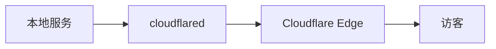
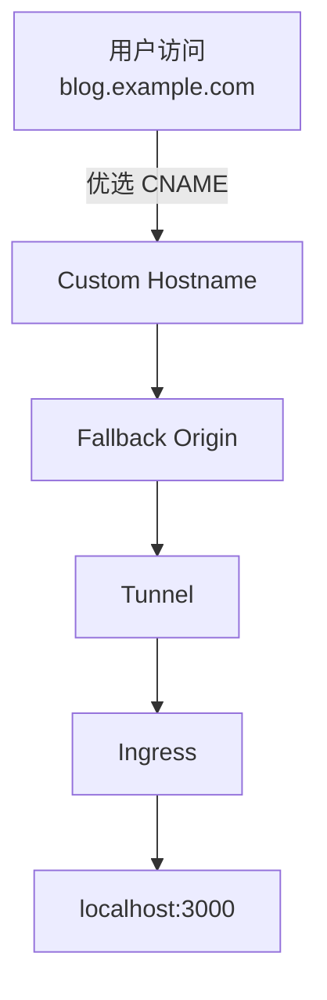

## 前言

去年折腾 Cloudflare Tunnel 的时候，我自己照着网上的方案给网站搭了一套 Tunnel + SaaS Custom Hostname + 优选 CNAME 的方案。

对于个人站点而言，这是我用过最省心的一套组合。

Tunnel 负责隐藏源站，无需开放公网端口；SaaS 配合优选 CNAME，可以把访问流量引导到更合适的线路上。对只有一台低配 VPS 的个人站长来说，它既省去了配置防火墙和反向代理的麻烦，又能获得不错的访问体验。

**真正麻烦的不是搭建，而是后续的维护。**

每上线一个新站点，我都要在 Cloudflare 控制台 里重复同一套流程：

- 打开 Tunnel 页面，修改 Public Hostname；
- 打开 DNS 页面，分别创建主域名和辅助域名的解析记录；
- 切换到 SSL/TLS，为域名申请 Custom Hostname；
- 设置 Fallback Origin；
- 最后等待 Cloudflare 同步配置、签发证书。

第一次配置的时候还挺有意思，但站点一多，这套流程就开始变成重复劳动。

我第一反应其实是去 GitHub 找现成的。找了一圈，可能是我没找到，也可能确实没人做。

既然没有，那就自己写一个。

其实一开始只是打算写给自己用，后来觉得整理一下，也许其他人也能用得上。

于是就有了 **Cloudflare Tunnel Manager**。

> **📦 Cloudflare Tunnel Manager**
>
> 一个用于管理 Cloudflare Tunnel 的可视化面板。
>
> 它将 Tunnel、DNS、SaaS Custom Hostname 等原本分散在不同页面的配置整合到一起，只需要填写几个参数，就能完成整套绑定流程。

::github{repo="qiuyuxc/tunnel-manager"}


## 它解决的不是 Tunnel，而是整套配置流程

如果只是把本地服务暴露到公网，Cloudflare Tunnel 的链路其实非常清晰：



**真正让这套方案变得复杂的，是当你把 SaaS 和优选 CNAME 也纳入进来之后。**

一个请求从用户发起，到最终抵达本地服务，实际上要经过下面这几层配置：



这些配置虽然最终组成了一条完整的访问链路，但却分散在 Cloudflare 控制台的不同页面，由不同的 API 分别负责。这意味着，每新增一个站点，你都需要在不同页面之间来回切换，按照正确的顺序完成这些配置，才能把整条链路连接起来。

**Cloudflare Tunnel Manager 做的事情其实很简单，就是把这套分散的配置流程串联起来，并交给程序自动完成。**


## 现在绑定一个站点，只需要几步

以前绑定一个站点，大概要花五六分钟。

现在整个流程被压缩成了几个输入框：

- 选择 Tunnel
- 输入主域名
- 输入辅助域名
- 输入服务地址
- 点击绑定

剩下的事情全部交给程序完成。真正需要等待的，只有 Cloudflare 自己同步配置和签发证书的那段时间。

对于经常新增项目或者维护多个 Tunnel 的人来说，便捷性带来的体验还是很明显的。


## 点击一次绑定，后台到底做了什么？

面板里只有一个「绑定」按钮，但后台其实会依次完成下面几件事：

1. **查询 Zone ID**：根据主域名和辅助域名，自动查找对应的 Zone ID，支持子域名到根域名的最长匹配；
2. **更新 Tunnel Ingress**：将主域名和辅助域名加入路由，并确保 `http_status:404` 的兜底规则始终位于末尾；
3. **Upsert DNS 记录**：对主域名和辅助域名执行先查后写。辅助域名创建 CNAME 指向 `{tunnelID}.cfargotunnel.com` 并开启 Cloudflare 代理；主域名创建 CNAME 指向优选地址（如 `cf.090227.xyz`），不开启代理；
4. **设置 Fallback Origin**：在辅助域名所在 Zone 注册回退源；
5. **创建 Custom Hostname**：在辅助域名所在 Zone 提交主域名作为 Custom Hostname，等待 Cloudflare 自动完成证书签发。

所以绑定流程并不是简单地连续调几个接口，而是按照正确的顺序，一步一步完成。只有先设置好 Fallback Origin，Custom Hostname 的回源链路才能正确建立；而 DNS 记录的 Upsert 策略（先查询再更新或创建）则避免了重复提交导致的冲突。

只要 API 返回成功，这条访问链路基本就已经配置完毕。相比手动配置，最大的好处不是节省那几分钟，而是**再也不用担心自己漏掉其中某一步，或者把顺序搞错**。


## 实现时需要注意的几个细节

整个项目的开发其实比预想中顺利不少。在这之前，我已经写过基于 Cloudflare API 的 Go CLI 和 Workers，对 Tunnel、DNS、SaaS 这些接口都比较熟悉。因此，这个 Web 面板更多是在将现有的逻辑拼接起来。

真正需要注意的，反而是一些很容易被忽略的小细节。

### Catch-all Rule 不能放错位置

Cloudflare Tunnel 的 Ingress 是按照数组顺序匹配的。

每个 Tunnel 都会有一条 Cloudflare 自动生成的兜底规则：

```json
{
    "service": "http_status:404"
}
```

它始终位于整个 Ingress 的最后。

很多人第一次修改 Ingress 时，会下意识地把新规则追加到数组末尾。但如果直接追加到数组末尾，新规则就会排在 Catch-all Rule 后面，导致无法按预期匹配。

因此，更新 Ingress 时必须先把最后一条兜底规则取出来，插入新的 Hostname 规则后，再把它放回数组末尾。

项目里的处理方式如下：

```go
newRules := []models.IngressRule{
    {
        Hostname: req.MainDomain,
        Service: cfg.ServiceURL,
    },
    {
        Hostname: req.AuxDomain,
        Service: cfg.ServiceURL,
    },
}

ingress := tunnelCfg.Result.Config.Ingress
lastRule := ingress[len(ingress)-1]

ingress = append(
    ingress[:len(ingress)-1],
    newRules...,
)

ingress = append(ingress, lastRule)
```

虽然只是几行代码，但它保证了每次新增路由时，都不会破坏已有的匹配顺序。否则，请求可能无法匹配到新增的 Hostname，最终无法正常访问对应服务。

### Fallback Origin 为什么要先于 Custom Hostname？

除了 Ingress，第一次接触 SaaS 时还容易忽略 **Fallback Origin** 与 **Custom Hostname** 之间的依赖关系。

很多人会误以为，只要调用 Custom Hostname 接口把主域名提交给 Cloudflare，就算完成了。但实际上，Cloudflare 必须先知道这个域名最终应该回源到哪里，因此必须先把辅助域名注册为当前 Zone 的 Fallback Origin。

项目内部严格按照这个顺序处理：

```text
Fallback Origin
        │
        ▼
Custom Hostname
        │
        ▼
等待证书签发
```

先调用 `PUT /zones/{zone_id}/custom_hostnames/fallback_origin` 设置回退源，随后再调用 `POST /zones/{zone_id}/custom_hostnames` 创建对外访问的 Custom Hostname。

如果顺序颠倒，Cloudflare 往往无法按预期完成证书申请。所以绑定流程并不是简单地连续调几个接口，而是**按照 Cloudflare 的配置依赖关系，一步一步完成**。

## 比绑定域名更常用的，其实是在线管理 Tunnel 路由

如果让我选整个项目最满意的功能，不是自动绑定，而是在线管理 Tunnel 路由。

最开始写这个项目时，我只是想把绑定域名这件事自动化掉。

真正开始使用以后，我才发现，自己最常用的反而不是绑定功能，而是路由管理。

因为一个 Tunnel 往往会承载多个服务。比如：

| Hostname | Service |
| -------- | ------- |
| blog.example.com | http://localhost:3000 |
| status.example.com | http://localhost:3001 |
| api.example.com | http://localhost:8080 |

随着项目增多，经常需要修改端口、删除某个服务，新增一条路由进行测试，以前只能进入 Cloudflare 控制台的 Public Hostname（公共主机名）页面操作，现在可以直接在面板里完成。

页面会读取当前 Tunnel 的 Ingress 配置，以列表形式展示当前 Tunnel 的所有路由，支持查看、新增、编辑和删除。

唯一不允许手动修改的是那条 Cloudflare 自动生成的 Catch-all Rule——因为它始终应该留在最后，处理未匹配到任何规则的请求。

这也是整个项目目前我自己最常使用的功能。很多时候只是改一个端口，或者临时起一个测试服务，不需要再打开 Cloudflare 控制台。


## 除了 Web 面板，也支持 Telegram Bot

除了浏览器，这个项目还集成了 Telegram Bot，主要是为了方便远程管理。

比如服务器放在家里，或者人在外面时，不用登录面板，直接打开 Telegram 就能完成一些常用操作。

目前支持：

- 查看 Tunnel 状态
- 查看当前配置
- 设置优选 CNAME
- 设置回退源
- 域名绑定

如果只是偶尔新增一个站点，通过 Bot 直接操作往往比打开浏览器更快。


## 项目结构

在技术选型上，我刻意避开了重型方案。

更希望它能跑在各种低配置 VPS 上，所以整体保持简单：

```text
┌──────────────┐
│ Vue 3 Frontend │
└──────┬───────┘
       │ HTTP API
┌──────▼───────┐
│ Go Backend   │
└──────┬───────┘
       │
┌──────▼────────────────┐
│ Cloudflare REST API   │
└───────────────────────┘
```

前端使用 Vue 3 + TypeScript + Naive UI + Pinia，负责页面展示和交互。

后端使用 Go + chi Router，所有配置直接保存在 JSON 文件中，不依赖 MySQL 或 PostgreSQL。

对于这个场景来说，这种方式已经足够，也降低了部署门槛。


## 针对国内服务器做了一些优化

很多使用 Tunnel 的用户，本身就是因为服务器线路一般，或者公网环境不太方便。因此部署时，我也顺手做了一些针对国内环境的优化。

### 镜像源自动切换

安装脚本会先检测 `ghcr.io` 能否正常访问。如果超时，则自动切换到国内镜像，避免 Docker 拉取镜像速度过慢。

### 自动生成管理员密码

第一次启动时，如果没有指定管理员密码，程序会自动生成一个随机密码并输出到日志中，避免部署后直接使用默认密码的风险。

### 一键部署

复制以下命令即可一键安装：

```bash
curl -sO https://raw.githubusercontent.com/qiuyuxc/tunnel-manager/main/install.sh && bash install.sh
```

脚本会自动检查 Docker、创建配置、引导填写 Cloudflare Token、构建镜像并启动容器，整个过程基本不需要手动修改配置文件。


## API Token 权限

这个项目只需要几个最小权限的 Cloudflare API Token 即可运行：

| 范围 | 权限 | 用途 |
|------|------|------|
| Tunnel | Edit | 修改 Ingress、查询 Tunnel |
| DNS | Edit | 创建 DNS 记录 |
| Zone | Read | 获取 Zone ID |
| SSL and Certificates | Edit | 设置 Fallback Origin、创建 Custom Hostname |

不需要使用全局 API Key，也不需要给账号授予更多权限。如果部署在第三方服务器，这样会更安全一些。


## 写在最后

说到底，这个面板并没有创造什么新的能力，只是把原本需要手动完成的操作，交给程序去调用 Cloudflare API 自动完成。

现在新增一个站点，不需要再反复打开 Tunnel、DNS、SSL/TLS 几个页面来回切换。填写几个参数，点击一次按钮，剩下的事情交给程序完成。

对于偶尔新增一个站点的人来说，可能只是节省了几分钟。但如果长期维护多个 Tunnel、多套服务，或者经常折腾新项目，这种重复操作很快就会变成一种负担。

**至少以后再新增一个站点的时候，我不用再打开四五个 Cloudflare 页面，把同样的操作再重复一遍了。**

如果你也经常使用 Cloudflare Tunnel，希望这个项目能帮你省下一点时间。如果觉得有用，欢迎到 GitHub 点个 Star，或者一起交流、提出新的想法。
```